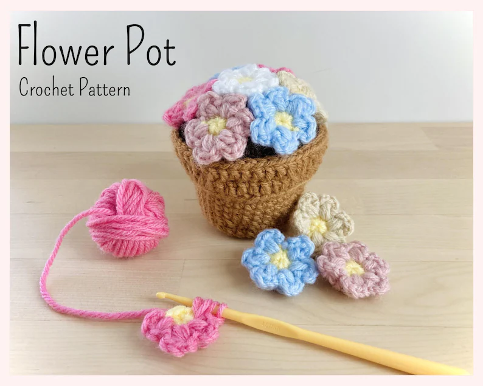

**An app to count your crochet pattern's stitches!** Made with SwiftUI with no 3rd party dependencies. [Mac app](https://github.com/aheze/StitchCounter/raw/main/Assets/StitchCounter.zip) • [iOS app](https://github.com/aheze/StitchCounter/raw/main/Assets/StitchCounter.ipa)

### Purpose
To count the number of stitches in a crochet pattern. My sister runs an Etsy shop, [StuffingStuff](https://www.etsy.com/shop/StuffingStuff), which sells crochet stuff and patterns. Supposedly, manually counting stitches to make a pattern is very tedious and error-prone. This app makes it easy.

### Features

<table>
<tr>
<td>
Counter
</td>
<td>
Settings
</td>
</tr>
  
  
  
<tr>
<td>
 
</td>
<td>

</td>
</tr>
  
<tr>
<td colspan="2"> 
  
- Write any pattern, then press <strong>Count</strong>. That's it!
- It's powered by regex, so your pattern doesn't need to be perfect.
- Press the number to copy it to your clipboard.
- The breakdown lets you double-check to make sure everything is right.
- Have your own stitch abbreviations? No problem, just go to **Settings**, then press <strong>Save</strong>.
- Stitch abbreviations support regex too.
- You can even set the number of stitches for each abbreviation.
</td>
</tr>
</table>

### Crochet abbreviation reference

<strong>What's crochet?</strong>

 
  
> Crochet is a process of creating textiles by using a crochet hook to interlock loops of yarn, thread, or strands of other materials. The name is derived from the French term crochet, meaning 'small hook'. Hooks can be made from a variety of materials, such as metal, wood, bamboo, or plastic. — [Wikipedia](https://en.wikipedia.org/wiki/Crochet)
  

  
---

<strong>What are patterns?</strong>

   
  
It's like an instruction manual, but for crocheting.
  
---

